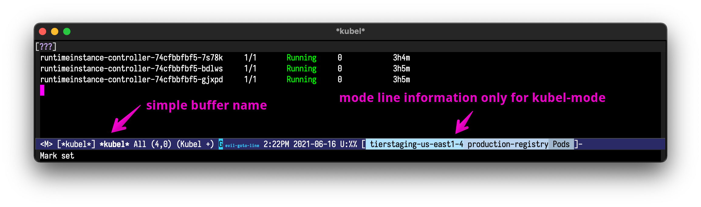

[](https://melpa.org/#/kubel)
[](https://app.circleci.com/pipelines/github/abrochard/kubel)

# kubel

Emacs extension for controlling Kubernetes with limited permissions.



You can [watch how kubel started](https://www.youtube.com/watch?v=w3krYEeqnyk) or [read about it](https://gist.github.com/abrochard/dd610fc4673593b7cbce7a0176d897de).


## Main differences with https://github.com/abrochard/kubel

My workflow needs to quickly change between multiple context, namespaces, and
resources, kubel triggered a metadata refresh everytime that one of these
changed. It also recreated the buffer and re-applied the mode (not sure why
yet?).

There is a new method `kubel-refresh` (bound to `g`) to call the kubectl command
by demand using the configured parameters.  It doesn't matter to me that some
metadata is stale, as most of the namespace/resources names that I use exist in
different clusters. If for some reason a name doesn't exist, I can just type it
or run `kubel-invalidate-caches` (`I`) or any of the new methods to fetch the
right objects `kubel-fetch-contexts` (`C`), `kubel-fetch-namespaces` (`N`),
`kubel-fetch-api-resource-list` (`R`).

- Changing cluster/namespace/resource doesn't call kubectl.
- Need to call `kubel-refresh` to run the command with the configured
  cluster/namespace/resource.
- Assume the user has access to list namespaces/resources.
- Removed remote tramp support.
- Don't recreate buffers, it only now uses the `*kubel*` buffer.
- Offer a method to show current configuration in the mode line.

My evil workflow bindings are:
```
  (kbd "I") #'kubel-invalidate-caches

  (kbd "c") #'kubel-set-context
  (kbd "C") #'kubel-fetch-contexts

  (kbd "n") #'kubel-set-namespace
  (kbd "N") #'kubel-fetch-namespaces

  (kbd "r") #'kubel-set-resource
  (kbd "R") #'kubel-fetch-api-resource-list

  (kbd "g") #'kubel-refresh
```

I've also mapped `q` to exit the yaml resource details:
```lisp
  (evil-define-key 'normal 'kubel-yaml-editing-mode "q" #'kill-current-buffer)
```

### Mode line configuration

`kubel-current-state` provides a method to show the current configuration in the mode line.
```lisp
(:eval (if (eq (buffer-local-value 'major-mode (current-buffer)) 'kubel-mode)
    (kubel-current-state)))
```

Example:
```lisp
(setq-default mode-line-format
              '("%e"
                mode-line-front-space
                "[" (:eval (diego/current-tab-name)) "]"
                " "
                mode-line-buffer-identification  " "
                mode-line-position
                minions-mode-line-modes
                (vc-mode vc-mode) " "
                mode-line-misc-info
                mode-line-mule-info
                mode-line-client
                mode-line-modified
                (:eval (if (eq (buffer-local-value 'major-mode (current-buffer)) 'kubel-mode)
                           (kubel-current-state)))
                mode-line-remote
                mode-line-frame-identification
                mode-line-end-spaces))
```

## Features
We now support managing pretty much any resource!

- switch context and namespace
- show any resource (pods/services/deployments/etc)
- highlight a resource by name
- copy resource name to clipboard
- show and edit resource details
- show rollout history for a resource
- delete a resource
- tail container logs (possibly with `-f` follow flag)
- copy container log command to clipboard
- port forward a pod to your localhost
- exec into a pod using tramp

## Installation

Get it from Melpa, or copy and load the `kubel.el` file.

If you want to have the evil compatibility package, get it from Melpa as well or
load the `kubel-evil.el` file.

## Usage

To list the pods in your current context and namespace, call
```
M-x kubel
```
To set said namespace and context, respectively call
```
M-x kubel-set-namespace
M-x kubel-set-context
```
Note that context will autocomplete but not necessarily namespaces
depending on your permissions and cluster setup.
See the [customize section](#Customize) on how to tune `kubel-use-namespace-list`.

To switch to showing a different resource, use the `R` command or
```
M-x kubel-set-resource
```
This will let you select a resource and re-display the kubel buffer.

## Shortcuts

On the kubel screen, place your cursor on a resource
```
enter => get resource details
C-u enter => describe resource
h => help popup
? => help popup
E => quick edit any resource
g => refresh
k => delete popup
r => see the rollout history for resource
p => port forward pod
l => log popup
e => exec popup
j => jab deployment to force rolling update
C => set context
n => set namespace
R => set resource
K => set kubectl config file
F => set output format
f => set a substring filter for resource name
M-n => jump to the next highlighted resource
M-p => jump to previous highlighted resource
m => mark item
u => unmark item
M => mark all items
U => unmark all items
c => copy popup
$ => show process buffer
s => show only resources with specified label value
```

## Editing a resource

After describing a resource in YAML format, you can edit the buffer and hit `C-c C-c` to apply your changes.

For example, if you want to edit a deployment, you can switch the resource with `R` and select "Deployments", then press return with the cursor on the row you wish to edit, edit the buffer, and hit `C-c C-c` to apply.

Alternatively, you can hit `E` to then select the resource type and the resource name of what you want to edit.

## Customize

- By default, kubel log tails from the last 100 lines, you can change the `kubel-log-tail-n` variable to set another line number.
- If you need to switch or set your kubectl config file by setting your `KUBECONFIG` environment variable, you can use the wrapper function `kubel-set-kubectl-config-file` or the `K` shortcut.
- Namespace listing for auto-completion is controlled by `kubel-use-namespace-list`:
  - auto - default, use `kubectl auth can-i list namespace` to determine if we can list namespaces
  - on - always assume we can list namespaces
  - off - always assume we cannot list namespaces

## Releases

See the [CHANGELOG.md](CHANGELOG.md) for the list of changes and maybe upcoming features.
